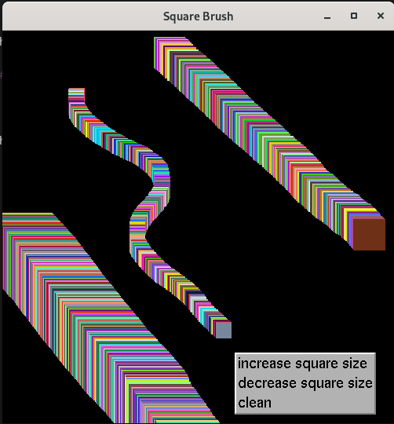
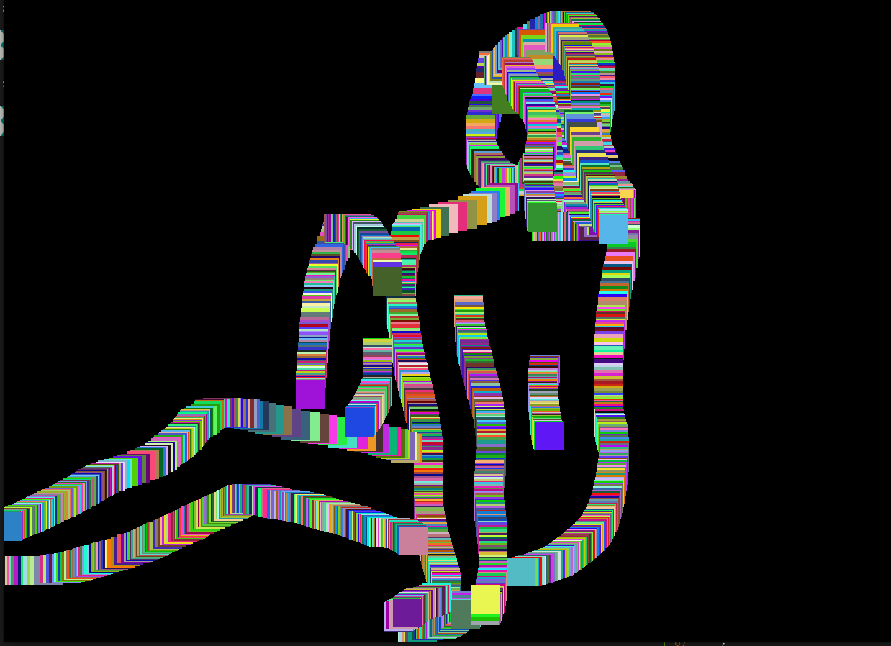

# SquareBrush

The program of drawing by square brush.

## Usage

- `$>make SquareBrush`
- To draw, you need to hold down the left mouse button. To open the menu, press the right mouse button. \
   \
  

